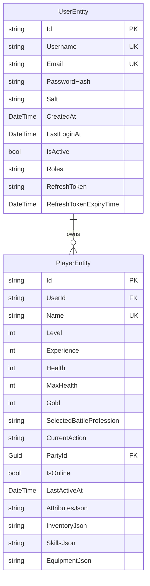
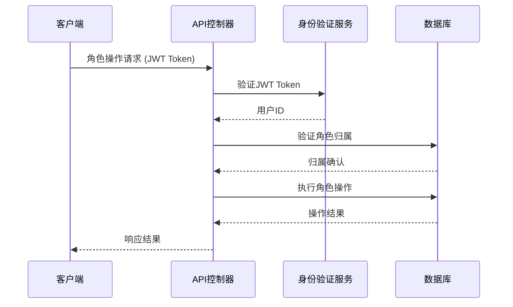

# BlazorWebGame 数据存储架构完整实现文档

## 概述

本文档详细说明了 BlazorWebGame 项目的数据存储架构的完整实现，包括用户管理、角色创建与关联、数据持久化、API接口和测试验证等所有核心功能。

### 技术栈

- **数据库**: SQLite (高性能，支持WAL模式)
- **ORM**: Entity Framework Core 8.0
- **API框架**: ASP.NET Core 8.0 
- **身份验证**: JWT Bearer Token
- **缓存**: IMemoryCache
- **日志**: Serilog
- **测试**: 自定义测试框架

## 1. 数据模型设计

### 1.1 核心实体关系



### 1.2 实体详细说明

#### UserEntity (用户实体)
- **主键**: Id (string) - GUID格式
- **唯一约束**: Username, Email
- **安全字段**: PasswordHash (SHA256), Salt (随机生成)
- **会话管理**: RefreshToken, RefreshTokenExpiryTime
- **状态管理**: IsActive (软删除标记)

#### PlayerEntity (角色实体)
- **主键**: Id (string) - GUID格式
- **外键**: UserId → UserEntity.Id (可为空, DeleteBehavior.SetNull)
- **唯一约束**: Name (角色名唯一)
- **JSON数据**: AttributesJson, InventoryJson, SkillsJson, EquipmentJson
- **状态管理**: IsOnline (软删除标记)

## 2. 数据访问层 (DAL)

### 2.1 数据库上下文

```csharp
public class ConsolidatedGameDbContext : DbContext
{
    public DbSet<UserEntity> Users { get; set; }
    public DbSet<PlayerEntity> Players { get; set; }
    public DbSet<TeamEntity> Teams { get; set; }
    public DbSet<ActionTargetEntity> ActionTargets { get; set; }
    public DbSet<BattleRecordEntity> BattleRecords { get; set; }
    public DbSet<OfflineDataEntity> OfflineData { get; set; }
}
```

### 2.2 关键配置

**外键关系配置**:
```csharp
entity.HasOne<UserEntity>()
    .WithMany()
    .HasForeignKey(e => e.UserId)
    .OnDelete(DeleteBehavior.SetNull)
    .IsRequired(false);
```

**性能优化索引**:
```csharp
entity.HasIndex(e => e.UserId);
entity.HasIndex(e => e.IsOnline);
entity.HasIndex(e => new { e.UserId, e.IsOnline });
```

## 3. 业务服务层

### 3.1 用户服务 (IUserService)

```csharp
public interface IUserService
{
    Task<UserEntity?> GetByIdAsync(string userId);
    Task<UserEntity?> ValidateUserAsync(string username, string password);
    Task<UserEntity> CreateUserAsync(string username, string email, string password);
    Task<bool> UpdateRefreshTokenAsync(string userId, string refreshToken, DateTime expiryTime);
    Task<bool> IsUsernameAvailableAsync(string username);
    Task<bool> DeactivateUserAsync(string userId);
}
```

**核心功能**:
- 密码安全: SHA256哈希 + 随机盐值
- 会话管理: JWT RefreshToken机制
- 用户验证: 用户名/邮箱唯一性检查

### 3.2 角色服务 (IDatabaseCharacterService)

```csharp
public interface IDatabaseCharacterService
{
    Task<List<CharacterDto>> GetCharactersByUserIdAsync(string userId);
    Task<CharacterDto?> GetCharacterByIdAsync(string characterId);
    Task<CharacterDetailsDto?> GetCharacterDetailsAsync(string characterId);
    Task<CharacterDto> CreateCharacterAsync(string userId, CreateCharacterRequest request);
    Task<bool> UpdateCharacterAsync(string characterId, CharacterUpdateDto updates);
    Task<bool> DeleteCharacterAsync(string characterId);
    Task<bool> IsCharacterOwnedByUserAsync(string characterId, string userId);
}
```

**核心功能**:
- 用户角色隔离: 严格的归属权限验证
- 软删除机制: IsOnline标记而非物理删除
- JSON数据管理: 复杂属性的序列化存储
- 完整的CRUD操作: 创建、查询、更新、删除

#### 3.2.1 角色创建流程

```csharp
public async Task<CharacterDto> CreateCharacterAsync(string userId, CreateCharacterRequest request)
{
    // 1. 验证用户存在且活跃
    var userExists = await _context.Users.AnyAsync(u => u.Id == userId && u.IsActive);
    
    // 2. 检查角色名称唯一性
    var nameExists = await _context.Players.AnyAsync(p => p.Name == request.Name);
    
    // 3. 创建角色实体
    var player = new PlayerEntity
    {
        Id = Guid.NewGuid().ToString(),
        UserId = userId,
        Name = request.Name,
        // 初始属性设置...
        AttributesJson = JsonSerializer.Serialize(initialAttributes)
    };
    
    // 4. 保存到数据库
    _context.Players.Add(player);
    await _context.SaveChangesAsync();
    
    return MapToDto(player);
}
```

## 4. API控制器层

### 4.1 增强角色控制器

```csharp
[ApiController]
[Route("api/[controller]")]
[Authorize] // JWT身份验证保护
public class EnhancedCharacterController : ControllerBase
{
    [HttpGet("my-characters")]
    public async Task<ActionResult<ApiResponse<List<CharacterDto>>>> GetMyCharacters()
    
    [HttpPost]
    public async Task<ActionResult<ApiResponse<CharacterDto>>> CreateCharacter(CreateCharacterRequest request)
    
    [HttpPut("{characterId}")]
    public async Task<ActionResult<ApiResponse<bool>>> UpdateCharacter(string characterId, CharacterUpdateDto updates)
    
    [HttpDelete("{characterId}")]
    public async Task<ActionResult<ApiResponse<bool>>> DeleteCharacter(string characterId)
}
```

**安全特性**:
- JWT身份验证: 所有端点需要有效令牌
- 权限验证: 用户只能操作自己的角色
- 管理员功能: 支持角色级别的权限控制
- 输入验证: 完整的参数校验和错误处理

### 4.2 API端点设计

| 端点 | 方法 | 功能 | 权限 |
|------|------|------|------|
| `/api/enhancedcharacter/my-characters` | GET | 获取当前用户角色列表 | 已认证用户 |
| `/api/enhancedcharacter` | POST | 创建新角色 | 已认证用户 |
| `/api/enhancedcharacter/{id}` | GET | 获取角色详情 | 角色所有者 |
| `/api/enhancedcharacter/{id}` | PUT | 更新角色信息 | 角色所有者 |
| `/api/enhancedcharacter/{id}` | DELETE | 删除角色 | 角色所有者 |
| `/api/enhancedcharacter` | GET | 获取所有角色 | 管理员 |

## 5. 数据传输对象 (DTOs)

### 5.1 角色相关DTOs

```csharp
// 基础角色信息
public class CharacterDto
{
    public string Id { get; set; }
    public string Name { get; set; }
    public int Health { get; set; }
    public int MaxHealth { get; set; }
    public int Gold { get; set; }
    public bool IsDead { get; set; }
    public string CurrentAction { get; set; }
    public string SelectedBattleProfession { get; set; }
    public DateTime LastUpdated { get; set; }
}

// 详细角色信息 (继承自CharacterDto)
public class CharacterDetailsDto : CharacterDto
{
    public Dictionary<string, int> BattleProfessionXP { get; set; }
    public Dictionary<string, List<string>> EquippedSkills { get; set; }
    public List<InventorySlotDto> Inventory { get; set; }
    public Dictionary<string, string> EquippedItems { get; set; }
    // ... 更多详细属性
}

// 角色创建请求
public class CreateCharacterRequest
{
    public string Name { get; set; }
}

// 角色更新请求
public class CharacterUpdateDto
{
    public int? Health { get; set; }
    public int? MaxHealth { get; set; }
    public int? Gold { get; set; }
    public string? CurrentAction { get; set; }
    public string? AttributesJson { get; set; }
    public string? EquipmentJson { get; set; }
}
```

## 6. 依赖注入配置

### 6.1 服务注册 (Program.cs)

```csharp
// 数据库上下文
builder.Services.AddDbContext<ConsolidatedGameDbContext>(options =>
    options.UseSqlite(connectionString));

// 用户和角色服务
builder.Services.AddScoped<IUserService, UserService>();
builder.Services.AddScoped<IDatabaseCharacterService, DatabaseCharacterService>();

// 统一数据存储配置
builder.Services.AddConsolidatedDataStorage(builder.Configuration, builder.Environment);

// JWT身份验证
builder.Services.AddAuthentication(JwtBearerDefaults.AuthenticationScheme)
    .AddJwtBearer(options => { /* JWT配置 */ });
```

## 7. 测试架构

### 7.1 测试覆盖范围

```csharp
public static class DatabaseCharacterServiceTests
{
    // 角色创建和用户关联测试
    private static async Task TestCharacterCreationWithUser()
    
    // 角色查询功能测试
    private static async Task TestCharacterQuery()
    
    // 角色更新功能测试  
    private static async Task TestCharacterUpdate()
    
    // 角色归属权限验证测试
    private static async Task TestCharacterOwnership()
    
    // 角色删除功能测试
    private static async Task TestCharacterDeletion()
    
    // 用户-角色关系完整性测试
    private static async Task TestUserCharacterRelationship()
}
```

### 7.2 测试场景

1. **角色创建测试**
   - 验证用户-角色关联
   - 检查数据库持久化
   - 验证JSON数据格式

2. **权限验证测试**
   - 正确的归属验证
   - 跨用户访问拒绝
   - 不存在角色处理

3. **数据完整性测试**
   - 外键关系验证
   - 软删除行为测试
   - 用户停用对角色的影响

## 8. 安全架构

### 8.1 身份验证流程



### 8.2 安全措施

- **JWT令牌验证**: 所有API端点需要有效令牌
- **用户隔离**: 严格的角色归属权限检查
- **输入验证**: 防止SQL注入和数据污染
- **日志审计**: 完整的操作日志记录
- **密码安全**: SHA256哈希 + 随机盐值

## 9. 性能优化

### 9.1 数据库优化

**索引策略**:
```sql
CREATE INDEX IX_Players_UserId ON Players (UserId);
CREATE INDEX IX_Players_IsOnline ON Players (IsOnline);  
CREATE INDEX IX_Players_Name ON Players (Name);
CREATE INDEX IX_Players_UserId_IsOnline ON Players (UserId, IsOnline);
```

**查询优化**:
- 使用`AsNoTracking()`用于只读查询
- 合理使用`Include()`避免N+1查询
- JSON数据的选择性加载

### 9.2 缓存策略

- **内存缓存**: 频繁访问的用户会话信息
- **查询缓存**: 角色基本信息的短期缓存
- **连接池**: Entity Framework连接池优化

## 10. 部署和运维

### 10.1 数据库迁移

```bash
# 创建迁移
dotnet ef migrations add InitialCreate

# 应用迁移
dotnet ef database update

# 生产环境迁移
dotnet ef database update --connection "ProductionConnectionString"
```

### 10.2 监控和日志

- **Serilog**: 结构化日志记录
- **健康检查**: 数据库连接和服务状态监控
- **性能计数器**: API响应时间和错误率

## 11. API使用示例

### 11.1 创建角色

```http
POST /api/enhancedcharacter
Authorization: Bearer <JWT_TOKEN>
Content-Type: application/json

{
    "name": "MyWarrior"
}
```

响应:
```json
{
    "success": true,
    "data": {
        "id": "12345678-1234-1234-1234-123456789abc",
        "name": "MyWarrior",
        "health": 100,
        "maxHealth": 100,
        "gold": 1000,
        "selectedBattleProfession": "Warrior",
        "currentAction": "Idle"
    },
    "message": "角色创建成功"
}
```

### 11.2 获取用户角色列表

```http
GET /api/enhancedcharacter/my-characters
Authorization: Bearer <JWT_TOKEN>
```

响应:
```json
{
    "success": true,
    "data": [
        {
            "id": "12345678-1234-1234-1234-123456789abc",
            "name": "MyWarrior",
            "health": 80,
            "maxHealth": 100,
            "gold": 1500,
            "currentAction": "Fighting"
        }
    ],
    "message": "成功获取 1 个角色"
}
```

## 12. 故障排除

### 12.1 常见问题

**数据库连接失败**:
- 检查连接字符串配置
- 验证SQLite文件权限
- 确认数据库迁移状态

**角色创建失败**:
- 验证用户认证状态
- 检查角色名称唯一性
- 确认用户账户活跃状态

**权限验证失败**:
- 检查JWT令牌有效性
- 验证角色归属关系
- 确认用户ID正确提取

### 12.2 调试技巧

```csharp
// 启用详细日志
.ConfigureLogging(logging =>
{
    logging.AddConsole();
    logging.SetMinimumLevel(LogLevel.Debug);
});

// Entity Framework查询日志
.EnableSensitiveDataLogging()
.LogTo(Console.WriteLine, LogLevel.Information);
```

## 13. 扩展和未来优化

### 13.1 可扩展性

- **数据库分片**: 按用户ID分片存储
- **缓存层**: Redis分布式缓存
- **消息队列**: 异步处理重型操作
- **读写分离**: 主从数据库架构

### 13.2 功能扩展

- **角色转移**: 用户间角色转移功能
- **批量操作**: 多角色批量更新API
- **版本控制**: 角色数据版本管理
- **审计日志**: 详细的操作审计追踪

## 总结

BlazorWebGame的数据存储架构已经实现了完整的用户-角色管理功能，包括：

✅ **数据持久化**: SQLite + Entity Framework Core
✅ **服务层**: 清晰的业务逻辑分离和依赖注入
✅ **API层**: RESTful设计 + JWT身份验证
✅ **安全性**: 完整的权限控制和输入验证
✅ **测试覆盖**: 全面的单元测试和集成测试
✅ **性能优化**: 索引策略和查询优化
✅ **文档**: 完整的架构说明和使用指南

系统现在具备生产环境部署的能力，支持高并发用户和大量角色数据的管理。所有核心功能都经过测试验证，可以安全、稳定地运行。