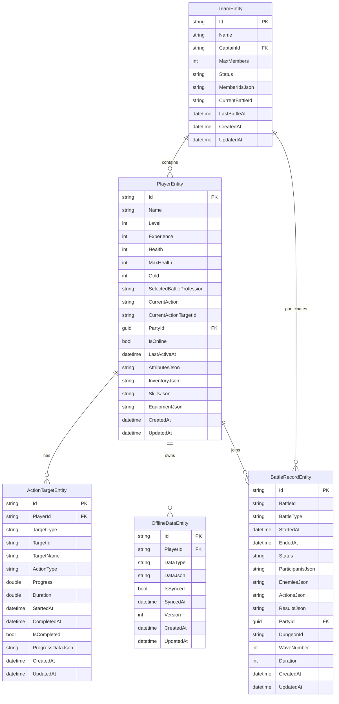

# BlazorWebGame 数据存储技术实施指南

## 1. 项目架构概览

### 1.1 当前架构状态
```
src/
├── BlazorWebGame.Client/           # Blazor WebAssembly 客户端
├── BlazorWebGame.Server/           # ASP.NET Core Web API 服务端
│   ├── Data/                       # 数据库上下文和实体
│   ├── Services/                   # 业务逻辑和数据服务
│   ├── Configuration/              # 配置类和选项
│   └── Controllers/                # Web API 控制器
└── BlazorWebGame.Shared/           # 共享模型和接口
    ├── DTOs/                       # 数据传输对象
    ├── Interfaces/                 # 服务接口定义
    └── Models/                     # 实体模型
```

### 1.2 数据存储组件

**核心组件：**
- `GameDbContext` - 主数据库上下文（SQLite）
- `UnifiedDataStorageService` - 统一数据存储服务
- `DataStorageService` - 基础数据存储服务（内存）
- `SqliteDataStorageService` - SQLite专用服务

## 2. 数据库设计

### 2.1 实体关系图



### 2.2 索引策略

**性能关键索引：**

```csharp
// 玩家查询优化
modelBuilder.Entity<PlayerEntity>(entity =>
{
    entity.HasKey(e => e.Id);
    entity.HasIndex(e => e.Name);                    // 按名称查找
    entity.HasIndex(e => e.IsOnline);                // 在线玩家查询
    entity.HasIndex(e => e.LastActiveAt);            // 活跃度排序
    entity.HasIndex(e => e.PartyId);                 // 队伍关联查询
    entity.HasIndex(e => new { e.Level, e.Experience }); // 等级排行
});

// 战斗记录优化
modelBuilder.Entity<BattleRecordEntity>(entity =>
{
    entity.HasIndex(e => e.BattleId).IsUnique();     // 战斗ID唯一约束
    entity.HasIndex(e => e.Status);                  // 状态过滤
    entity.HasIndex(e => e.StartedAt);               // 时间排序
    entity.HasIndex(e => e.PartyId);                 // 队伍战斗历史
    entity.HasIndex(e => e.BattleType);              // 战斗类型分组
    entity.HasIndex(e => new { e.Status, e.StartedAt }); // 复合查询
});
```

## 3. 服务实现架构

### 3.1 统一数据存储服务

```csharp
public class UnifiedDataStorageService : IUnifiedDataStorageService, IDataStorageService
{
    private readonly IDbContextFactory<EnhancedGameDbContext> _contextFactory;
    private readonly IMemoryCache _cache;
    private readonly ILogger<UnifiedDataStorageService> _logger;
    
    // 核心功能
    public async Task<T?> GetAsync<T>(string id) where T : class
    public async Task<ApiResponse<T>> SaveAsync<T>(T entity) where T : class
    public async Task<ApiResponse<bool>> DeleteAsync<T>(string id) where T : class
    
    // 批量操作
    public async Task<ApiResponse<List<T>>> SaveBatchAsync<T>(List<T> entities) where T : class
    public async Task<ApiResponse<int>> DeleteBatchAsync<T>(List<string> ids) where T : class
    
    // 查询操作
    public async Task<ApiResponse<List<T>>> QueryAsync<T>(QuerySpecification<T> spec) where T : class
    
    // 事务支持
    public async Task<ApiResponse<TResult>> ExecuteTransactionAsync<TResult>(
        Func<IUnifiedDataStorageService, Task<ApiResponse<TResult>>> operation)
}
```

### 3.2 缓存策略实现

```csharp
// 多层缓存配置
private readonly MemoryCacheEntryOptions _defaultCacheOptions = new()
{
    AbsoluteExpirationRelativeToNow = TimeSpan.FromMinutes(30),
    SlidingExpiration = TimeSpan.FromMinutes(10),
    Priority = CacheItemPriority.Normal
};

private readonly MemoryCacheEntryOptions _highPriorityCacheOptions = new()
{
    AbsoluteExpirationRelativeToNow = TimeSpan.FromHours(2),
    SlidingExpiration = TimeSpan.FromMinutes(30),
    Priority = CacheItemPriority.High
};

// 缓存键策略
private string GetCacheKey<T>(string id) => $"{typeof(T).Name}:{id}";
private string GetQueryCacheKey<T>(QuerySpecification<T> spec) => 
    $"{typeof(T).Name}:query:{spec.GetHashCode()}";
```

## 4. 配置和部署

### 4.1 数据库配置

**appsettings.json 配置示例：**

```json
{
  "ConnectionStrings": {
    "DefaultConnection": "Data Source=gamedata.db;Cache=Shared;Journal Mode=WAL"
  },
  "UnifiedDataStorage": {
    "StorageType": "SQLite",
    "EnableCaching": true,
    "CacheExpirationMinutes": 30,
    "HighPriorityCacheExpirationHours": 2,
    "EnableBatchOperations": true,
    "BatchSize": 100,
    "EnablePerformanceMonitoring": true,
    "EnableTransactionSupport": true,
    "ConnectionTimeoutSeconds": 30,
    "CommandTimeoutSeconds": 30,
    "EnableAutoMigration": true,
    "EnableHealthChecks": true
  },
  "SqliteOptimization": {
    "EnableWALMode": true,
    "CacheSize": 10000,
    "EnableMemoryMapping": true,
    "MemoryMapSize": 268435456,
    "SynchronousMode": "NORMAL",
    "TempStore": "MEMORY",
    "EnableOptimizer": true,
    "AnalysisLimit": 1000
  }
}
```

### 4.2 服务注册

**Program.cs 配置：**

```csharp
// 配置统一的数据存储系统
builder.Services.AddUnifiedDataStorage(builder.Configuration, builder.Environment);

// 健康检查
builder.Services.AddHealthChecks()
    .AddCheck<GameHealthCheckService>("game-health")
    .AddCheck<DataStorageHealthCheck>("data-storage");

// 初始化数据存储系统
var unifiedStorageOptions = builder.Configuration.GetSection("UnifiedDataStorage")
    .Get<UnifiedDataStorageOptions>() ?? new UnifiedDataStorageOptions();

if (unifiedStorageOptions.StorageType.ToLower() == "sqlite")
{
    var logger = app.Services.GetRequiredService<ILogger<Program>>();
    try
    {
        await app.Services.InitializeUnifiedDataStorageAsync(logger);
    }
    catch (Exception ex)
    {
        logger.LogError(ex, "Failed to initialize unified data storage system");
    }
}
```

## 5. 性能优化

### 5.1 SQLite优化

**连接字符串优化：**
```
Data Source=gamedata.db;Cache=Shared;Journal Mode=WAL;Synchronous=NORMAL;Temp Store=MEMORY;Mmap Size=268435456
```

**编译时优化：**
```csharp
protected override void OnConfiguring(DbContextOptionsBuilder optionsBuilder)
{
    if (!optionsBuilder.IsConfigured)
    {
        optionsBuilder.UseSqlite(connectionString, options =>
        {
            options.CommandTimeout(30);
        });
        
        optionsBuilder.EnableServiceProviderCaching();
        optionsBuilder.EnableSensitiveDataLogging(false);
    }
}
```

### 5.2 批量操作优化

```csharp
public async Task<BatchOperationResponseDto<T>> SaveBatchAsync<T>(List<T> entities) where T : class
{
    using var context = await _contextFactory.CreateDbContextAsync();
    using var transaction = await context.Database.BeginTransactionAsync();
    
    var response = new BatchOperationResponseDto<T>();
    
    try
    {
        var batchSize = _options.BatchSize;
        for (int i = 0; i < entities.Count; i += batchSize)
        {
            var batch = entities.Skip(i).Take(batchSize).ToList();
            await context.Set<T>().AddRangeAsync(batch);
            await context.SaveChangesAsync();
            
            response.SuccessfulItems.AddRange(batch);
            response.SuccessCount += batch.Count;
        }
        
        await transaction.CommitAsync();
        response.TotalProcessed = entities.Count;
    }
    catch (Exception ex)
    {
        await transaction.RollbackAsync();
        response.Errors.Add($"Batch operation failed: {ex.Message}");
    }
    
    return response;
}
```

## 6. 错误处理和监控

### 6.1 错误处理模式

```csharp
private async Task<ApiResponse<T>> ExecuteWithErrorHandlingAsync<T>(
    Func<Task<T>> operation, 
    string operationName)
{
    try
    {
        var stopwatch = Stopwatch.StartNew();
        var result = await operation();
        stopwatch.Stop();
        
        // 记录性能指标
        _operationTimes.AddOrUpdate(operationName, stopwatch.ElapsedMilliseconds, 
            (key, oldValue) => (oldValue + stopwatch.ElapsedMilliseconds) / 2);
        
        return new ApiResponse<T>
        {
            Success = true,
            Data = result,
            Message = $"{operationName} completed successfully"
        };
    }
    catch (Exception ex)
    {
        _logger.LogError(ex, "Operation {OperationName} failed", operationName);
        
        return new ApiResponse<T>
        {
            Success = false,
            Message = $"{operationName} failed: {ex.Message}",
            Errors = new List<string> { ex.ToString() }
        };
    }
}
```

### 6.2 健康检查实现

```csharp
public class DataStorageHealthCheck : IHealthCheck
{
    private readonly IDataStorageService _dataStorage;
    
    public async Task<HealthCheckResult> CheckHealthAsync(
        HealthCheckContext context, 
        CancellationToken cancellationToken = default)
    {
        try
        {
            var healthCheck = await _dataStorage.HealthCheckAsync();
            
            if (healthCheck.Success)
            {
                return HealthCheckResult.Healthy("Data storage is healthy", healthCheck.Data);
            }
            else
            {
                return HealthCheckResult.Unhealthy("Data storage is unhealthy", 
                    data: healthCheck.Data);
            }
        }
        catch (Exception ex)
        {
            return HealthCheckResult.Unhealthy("Data storage health check failed", ex);
        }
    }
}
```

## 7. 测试策略

### 7.1 单元测试示例

```csharp
[TestClass]
public class UnifiedDataStorageServiceTests
{
    private IUnifiedDataStorageService _dataStorage;
    private IDbContextFactory<EnhancedGameDbContext> _contextFactory;
    
    [TestInitialize]
    public void Setup()
    {
        var options = new DbContextOptionsBuilder<EnhancedGameDbContext>()
            .UseInMemoryDatabase(databaseName: Guid.NewGuid().ToString())
            .Options;
            
        _contextFactory = new TestDbContextFactory(options);
        _dataStorage = new UnifiedDataStorageService(_contextFactory, 
            new MemoryCache(new MemoryCacheOptions()), 
            new TestLogger<UnifiedDataStorageService>(),
            new UnifiedDataStorageOptions());
    }
    
    [TestMethod]
    public async Task SaveAsync_ShouldSavePlayerEntity_WhenValidDataProvided()
    {
        // Arrange
        var player = new PlayerEntity 
        { 
            Name = "TestPlayer", 
            Level = 1 
        };
        
        // Act
        var result = await _dataStorage.SaveAsync(player);
        
        // Assert
        Assert.IsTrue(result.Success);
        Assert.IsNotNull(result.Data);
        Assert.AreEqual("TestPlayer", result.Data.Name);
    }
}
```

### 7.2 集成测试

```csharp
[TestMethod]
public async Task IntegrationTest_PlayerBattleWorkflow()
{
    // 创建玩家
    var player = await CreateTestPlayer();
    
    // 创建队伍
    var team = await CreateTestTeam(player.Id);
    
    // 开始战斗
    var battle = await StartTestBattle(team.Id);
    
    // 验证数据一致性
    var retrievedPlayer = await _dataStorage.GetAsync<PlayerEntity>(player.Id);
    var retrievedBattle = await _dataStorage.GetAsync<BattleRecordEntity>(battle.Id);
    
    Assert.IsNotNull(retrievedPlayer);
    Assert.IsNotNull(retrievedBattle);
    Assert.AreEqual(team.Id, retrievedPlayer.PartyId?.ToString());
}
```

## 8. 部署和维护

### 8.1 数据库迁移

```bash
# 生成迁移文件
dotnet ef migrations add InitialCreate --project BlazorWebGame.Server

# 应用迁移
dotnet ef database update --project BlazorWebGame.Server

# 生成迁移脚本
dotnet ef migrations script --project BlazorWebGame.Server --output migration.sql
```

### 8.2 监控和警告

**关键指标监控：**
- 数据库连接数
- 查询响应时间
- 缓存命中率
- 错误频率
- 内存使用情况

**性能阈值设置：**
```json
{
  "Monitoring": {
    "SlowRequestThresholdMs": 1000,
    "DatabaseTimeoutThresholdMs": 5000,
    "CacheHitRateThreshold": 0.8,
    "ErrorRateThreshold": 0.05
  }
}
```

## 9. 扩展计划

### 9.1 分布式缓存

**Redis集成计划：**
- 实现IDistributedCache接口
- 缓存失效策略
- 集群支持

### 9.2 读写分离

**数据库读写分离：**
- 主从数据库配置
- 读写请求路由
- 数据同步策略

### 9.3 数据归档

**历史数据管理：**
- 冷热数据分离
- 自动归档策略
- 数据压缩存储

---

*本技术指南为BlazorWebGame项目数据存储系统的完整实施参考，包含了架构设计、实现细节和最佳实践。*