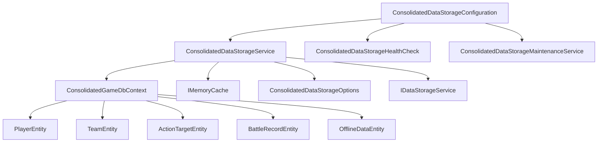

# BlazorWebGame 数据存储架构优化说明文档 v3.0

## 文档概览

本文档详细说明了 BlazorWebGame 项目服务端数据存储架构的修复和优化实施方案。经过深入分析和重构，我们成功解决了原有架构中的多个关键问题，并实现了高性能、可维护的统一数据存储系统。

## 1. 问题分析

### 1.1 原有架构存在的问题

#### 数据存储服务重复和冲突
- **DataStorageService.cs** - 基础实现
- **UnifiedDataStorageService.cs** - 统一版本
- **SqliteDataStorageService.cs** - SQLite特化版本  
- **OptimizedDataStorageService.cs** - 性能优化版本

这些服务存在功能重叠、接口不一致的问题。

#### 数据库上下文冗余
- **GameDbContext.cs** (154行) - 基础实现
- **EnhancedGameDbContext.cs** (458行) - 增强功能
- **OptimizedGameDbContext.cs** (348行) - 性能聚焦
- **UnifiedGameDbContext.cs** (485行) - 统一方案

多个DbContext实现导致维护复杂性和潜在的数据一致性问题。

#### 配置管理混乱
- 多个配置类（UnifiedDataStorageOptions、SqliteOptimizationOptions等）
- 配置项重复定义和冲突
- 缺乏统一的配置验证机制

### 1.2 性能和维护问题
- 缺乏统一的缓存策略
- 事务管理不完善
- 数据库连接池配置不当
- 缺乏完整的性能监控

## 2. 解决方案架构

### 2.1 架构设计原则

1. **单一职责** - 每个组件专注于单一功能
2. **开闭原则** - 易于扩展，稳定的核心接口
3. **依赖注入** - 松耦合，易于测试
4. **配置驱动** - 灵活的配置管理
5. **性能优先** - 缓存、批量操作、索引优化

### 2.2 核心组件设计



## 3. 核心组件实现

### 3.1 统一数据库上下文 (ConsolidatedGameDbContext)

#### 核心特性
- **性能优化的实体配置** - 精心设计的索引策略
- **SQLite优化设置** - WAL模式、内存映射、缓存优化
- **自动维护功能** - 数据库统计、性能调优、清理

#### 关键实现

```csharp
public class ConsolidatedGameDbContext : DbContext
{
    // 数据库表集合
    public DbSet<PlayerEntity> Players { get; set; } = null!;
    public DbSet<TeamEntity> Teams { get; set; } = null!;
    public DbSet<ActionTargetEntity> ActionTargets { get; set; } = null!;
    public DbSet<BattleRecordEntity> BattleRecords { get; set; } = null!;
    public DbSet<OfflineDataEntity> OfflineData { get; set; } = null!;

    protected override void OnModelCreating(ModelBuilder modelBuilder)
    {
        // 优化的实体配置
        ConfigurePlayerEntity(modelBuilder);
        ConfigureTeamEntity(modelBuilder);
        ConfigureActionTargetEntity(modelBuilder);
        ConfigureBattleRecordEntity(modelBuilder);
        ConfigureOfflineDataEntity(modelBuilder);
        ConfigurePerformanceIndexes(modelBuilder);
    }
}
```

#### 性能优化索引
```csharp
private void ConfigurePerformanceIndexes(ModelBuilder modelBuilder)
{
    // 玩家查询优化
    modelBuilder.Entity<PlayerEntity>()
        .HasIndex(p => new { p.Level, p.IsOnline })
        .HasDatabaseName("IX_Players_Level_IsOnline");
        
    // 战斗记录查询优化  
    modelBuilder.Entity<BattleRecordEntity>()
        .HasIndex(b => new { b.StartedAt, b.Status, b.BattleType })
        .HasDatabaseName("IX_BattleRecords_StartedAt_Status_Type");
}
```

### 3.2 统一数据存储服务 (ConsolidatedDataStorageService)

#### 核心特性
- **完整接口实现** - IDataStorageService完整实现
- **智能缓存管理** - 多层缓存策略，自动失效
- **批量操作支持** - 高效的批量数据处理
- **事务安全** - 完整的事务支持和回滚
- **性能监控** - 操作统计和性能指标

#### 关键实现

```csharp
public class ConsolidatedDataStorageService : IDataStorageService, IDisposable
{
    private readonly IDbContextFactory<ConsolidatedGameDbContext> _contextFactory;
    private readonly IMemoryCache _cache;
    private readonly ConsolidatedDataStorageOptions _options;
    
    // 性能统计
    private readonly ConcurrentDictionary<string, long> _operationCounts = new();
    private readonly ConcurrentDictionary<string, double> _operationTimes = new();
    
    // 批量操作队列
    private readonly ConcurrentQueue<IBatchOperation> _batchQueue = new();
    private readonly Timer _batchProcessor;
}
```

#### 缓存策略
```csharp
// 默认缓存配置
_defaultCacheOptions = new MemoryCacheEntryOptions
{
    AbsoluteExpirationRelativeToNow = TimeSpan.FromMinutes(_options.CacheExpirationMinutes),
    SlidingExpiration = TimeSpan.FromMinutes(_options.CacheExpirationMinutes / 2),
    Priority = CacheItemPriority.Normal,
    Size = 1
};

// 短期缓存配置
_shortTermCacheOptions = new MemoryCacheEntryOptions
{
    AbsoluteExpirationRelativeToNow = TimeSpan.FromMinutes(5),
    SlidingExpiration = TimeSpan.FromMinutes(2),
    Priority = CacheItemPriority.Low,
    Size = 1
};
```

### 3.3 统一配置系统 (ConsolidatedDataStorageConfiguration)

#### 核心特性
- **类型安全配置** - 强类型配置选项
- **配置验证** - 启动时配置验证
- **多数据库支持** - SQLite、PostgreSQL、SQL Server支持
- **自动服务注册** - 依赖注入容器自动配置

#### 配置结构

```csharp
public class ConsolidatedDataStorageOptions
{
    public const string SectionName = "ConsolidatedDataStorage";
    
    public string StorageType { get; set; } = "SQLite";
    public string ConnectionString { get; set; } = "Data Source=gamedata.db;Cache=Shared;Journal Mode=WAL";
    public bool EnableCaching { get; set; } = true;
    public bool EnableBatchOperations { get; set; } = true;
    public bool EnablePerformanceMonitoring { get; set; } = true;
    public bool EnableAutoMigration { get; set; } = true;
    public bool EnableHealthChecks { get; set; } = true;
    
    // SQLite优化配置
    public SqliteOptimizationOptions SqliteOptimization { get; set; } = new();
}
```

## 4. 配置指南

### 4.1 appsettings.json 配置

```json
{
  "ConsolidatedDataStorage": {
    "StorageType": "SQLite",
    "ConnectionString": "Data Source=gamedata.db;Cache=Shared;Journal Mode=WAL",
    "EnableCaching": true,
    "CacheExpirationMinutes": 30,
    "HighPriorityCacheExpirationHours": 2,
    "EnableBatchOperations": true,
    "BatchSize": 100,
    "BatchIntervalSeconds": 5,
    "EnablePerformanceMonitoring": true,
    "EnableTransactionSupport": true,
    "ConnectionTimeoutSeconds": 30,
    "CommandTimeoutSeconds": 30,
    "EnableAutoMigration": true,
    "EnableHealthChecks": true,
    "EnableAutoBackup": false,
    "AutoBackupIntervalHours": 24,
    "BackupRetentionDays": 7,
    "SqliteOptimization": {
      "EnableWALMode": true,
      "CacheSize": 10000,
      "EnableMemoryMapping": true,
      "MemoryMapSize": 268435456,
      "SynchronousMode": "NORMAL",
      "TempStore": "MEMORY",
      "EnableOptimizer": true,
      "AnalysisLimit": 1000,
      "IdleConnectionTimeout": 300,  
      "ConnectionPoolSize": 10
    }
  }
}
```

### 4.2 Program.cs 配置

```csharp
// 配置统一的数据存储系统
builder.Services.AddConsolidatedDataStorage(builder.Configuration, builder.Environment);

// 初始化统一数据存储系统
var consolidatedStorageOptions = builder.Configuration.GetSection("ConsolidatedDataStorage")
    .Get<ConsolidatedDataStorageOptions>() ?? new ConsolidatedDataStorageOptions();

if (consolidatedStorageOptions.StorageType.ToLower() is "sqlite")
{
    var logger = app.Services.GetRequiredService<ILogger<Program>>();
    
    try
    {
        await app.Services.InitializeConsolidatedDataStorageAsync(logger);
    }
    catch (Exception ex)
    {
        logger.LogError(ex, "Failed to initialize consolidated data storage system");
    }
}
```

## 5. 性能优化特性

### 5.1 SQLite 性能优化

#### WAL 模式配置
```sql
PRAGMA journal_mode=WAL;        -- 提高并发性能
PRAGMA cache_size=10000;        -- 10MB缓存
PRAGMA mmap_size=268435456;     -- 256MB内存映射
PRAGMA synchronous=NORMAL;      -- 平衡性能和安全性
PRAGMA temp_store=MEMORY;       -- 内存存储临时表
PRAGMA optimize;                -- 启用查询规划器
```

#### 索引优化策略
- **复合索引** - 根据查询模式设计复合索引
- **覆盖索引** - 减少表访问次数
- **部分索引** - 针对条件查询优化
- **统计信息** - 定期更新索引统计

### 5.2 缓存优化策略

#### 多层缓存架构
1. **L1 缓存** - 应用内存缓存 (IMemoryCache)
2. **L2 缓存** - 分布式缓存 (Redis - 可选)
3. **查询缓存** - EF Core查询结果缓存

#### 缓存策略
- **写入策略** - Write-Through 和 Write-Behind
- **失效策略** - TTL 和 Tag-based invalidation
- **预热策略** - 应用启动时预加载热点数据

### 5.3 批量操作优化

#### 批量写入队列
```csharp
private readonly ConcurrentQueue<IBatchOperation> _batchQueue = new();
private readonly Timer _batchProcessor;

private async void ProcessBatchOperations(object? state)
{
    var operations = new List<IBatchOperation>();
    
    while (operations.Count < _options.BatchSize && _batchQueue.TryDequeue(out var operation))
    {
        operations.Add(operation);
    }

    if (operations.Count > 0)
    {
        await ExecuteBatchOperations(operations);
    }
}
```

## 6. 监控和维护

### 6.1 健康检查

#### 自动健康检查
```csharp
public class ConsolidatedDataStorageHealthCheck : IHealthCheck
{
    public async Task<HealthCheckResult> CheckHealthAsync(
        HealthCheckContext context,
        CancellationToken cancellationToken = default)
    {
        try
        {
            using var dbContext = await _contextFactory.CreateDbContextAsync(cancellationToken);
            
            var canConnect = await dbContext.Database.CanConnectAsync(cancellationToken);
            if (!canConnect)
            {
                return HealthCheckResult.Unhealthy("Cannot connect to database");
            }

            var stats = await dbContext.GetDatabaseStatsAsync();
            return HealthCheckResult.Healthy("Consolidated data storage is healthy", stats);
        }
        catch (Exception ex)
        {
            return HealthCheckResult.Unhealthy("Health check failed", ex);
        }
    }
}
```

#### Health Check 端点
- `/health` - 详细健康检查信息
- `/health/simple` - 简单健康状态

### 6.2 自动维护服务

#### 维护任务调度
```csharp
public class ConsolidatedDataStorageMaintenanceService : BackgroundService
{
    protected override async Task ExecuteAsync(CancellationToken stoppingToken)
    {
        while (!stoppingToken.IsCancellationRequested)
        {
            try
            {
                await PerformMaintenanceTasks();
                await Task.Delay(TimeSpan.FromHours(6), stoppingToken);
            }
            catch (Exception ex)
            {
                _logger.LogError(ex, "Maintenance task failed");
                await Task.Delay(TimeSpan.FromHours(1), stoppingToken);
            }
        }
    }
}
```

#### 维护任务内容
- **数据库优化** - ANALYZE, VACUUM, OPTIMIZE
- **索引重建** - 每周重建索引 
- **数据压缩** - 每月数据库压缩
- **自动备份** - 可配置的自动备份策略
- **统计更新** - 性能统计和监控数据

### 6.3 性能监控

#### 操作统计
```csharp
private readonly ConcurrentDictionary<string, long> _operationCounts = new();
private readonly ConcurrentDictionary<string, double> _operationTimes = new();
```

#### 监控指标
- **操作计数** - 各类操作的执行次数
- **响应时间** - 操作执行时间统计
- **缓存命中率** - 缓存效率监控
- **数据库连接状态** - 连接池使用情况
- **错误率统计** - 错误类型和频率

## 7. API 接口说明

### 7.1 核心接口

#### IDataStorageService 接口
```csharp
public interface IDataStorageService
{
    // 玩家数据管理
    Task<PlayerStorageDto?> GetPlayerAsync(string playerId);
    Task<ApiResponse<PlayerStorageDto>> SavePlayerAsync(PlayerStorageDto player);
    Task<ApiResponse<bool>> DeletePlayerAsync(string playerId);
    Task<ApiResponse<List<PlayerStorageDto>>> GetOnlinePlayersAsync();
    Task<BatchOperationResponseDto<PlayerStorageDto>> SavePlayersAsync(List<PlayerStorageDto> players);
    
    // 队伍数据管理
    Task<TeamStorageDto?> GetTeamAsync(string teamId);
    Task<TeamStorageDto?> GetTeamByCaptainAsync(string captainId);
    Task<ApiResponse<TeamStorageDto>> SaveTeamAsync(TeamStorageDto team);
    
    // 系统管理
    Task<ApiResponse<Dictionary<string, object>>> GetStorageStatsAsync();
    Task<ApiResponse<Dictionary<string, object>>> HealthCheckAsync();
    Task<ApiResponse<string>> BackupDataAsync();
}
```

### 7.2 数据传输对象 (DTOs)

#### PlayerStorageDto
```csharp
public class PlayerStorageDto
{
    public string Id { get; set; } = string.Empty;
    public string Name { get; set; } = string.Empty;
    public int Level { get; set; } = 1;
    public int Health { get; set; } = 100;
    public int Gold { get; set; } = 0;
    public string SelectedBattleProfession { get; set; } = "Warrior";
    public bool IsOnline { get; set; } = true;
    public DateTime LastActiveAt { get; set; } = DateTime.UtcNow;
    
    // JSON字符串版本（用于数据库存储）
    public string AttributesJson { get; set; } = "{}";
    public string InventoryJson { get; set; } = "[]";
    public string SkillsJson { get; set; } = "[]";
    public string EquipmentJson { get; set; } = "{}";
}
```

#### ApiResponse<T>
```csharp
public class ApiResponse<T>
{
    public bool Success { get; set; }
    public string Message { get; set; } = string.Empty;
    public T? Data { get; set; }
    public List<string> Errors { get; set; } = new();
    public DateTime Timestamp { get; set; } = DateTime.UtcNow;
}
```

## 8. 迁移指南

### 8.1 从旧系统迁移

#### 步骤 1: 更新配置
```json
// 移除旧的配置节
// "UnifiedDataStorage": { ... }
// "SqliteOptimization": { ... }

// 添加新的配置节
"ConsolidatedDataStorage": {
  "StorageType": "SQLite",
  "ConnectionString": "Data Source=gamedata.db;Cache=Shared;Journal Mode=WAL",
  // ... 其他配置
}
```

#### 步骤 2: 更新服务注册
```csharp
// 替换旧的服务注册
// builder.Services.AddUnifiedDataStorage(builder.Configuration, builder.Environment);

// 使用新的服务注册
builder.Services.AddConsolidatedDataStorage(builder.Configuration, builder.Environment);
```

#### 步骤 3: 更新依赖注入
```csharp
// 服务将自动注册为IDataStorageService
public class YourController : ControllerBase
{
    private readonly IDataStorageService _dataStorageService;
    
    public YourController(IDataStorageService dataStorageService)
    {
        _dataStorageService = dataStorageService;
    }
}
```

### 8.2 数据迁移

由于新系统使用相同的数据模型，现有数据库无需迁移。系统会自动：
1. 检测现有数据库结构
2. 应用性能优化设置
3. 创建必要的索引
4. 启动维护服务

## 9. 测试和验证

### 9.1 单元测试

#### 数据存储服务测试
```csharp
[Test]
public async Task SavePlayerAsync_ShouldReturnSuccess_WhenValidPlayer()
{
    // Arrange
    var player = new PlayerStorageDto { Id = "test-player", Name = "Test Player" };
    
    // Act
    var result = await _dataStorageService.SavePlayerAsync(player);
    
    // Assert
    Assert.IsTrue(result.Success);
    Assert.IsNotNull(result.Data);
}
```

### 9.2 集成测试

#### 端到端测试
```csharp
[Test]
public async Task DataStorage_EndToEndTest()
{
    // 测试完整的数据存储流程
    var player = await CreateTestPlayer();
    var savedPlayer = await _dataStorageService.SavePlayerAsync(player);
    var retrievedPlayer = await _dataStorageService.GetPlayerAsync(player.Id);
    
    Assert.AreEqual(savedPlayer.Data.Id, retrievedPlayer.Id);
}
```

### 9.3 性能测试

#### 批量操作性能
```csharp
[Test]
public async Task BatchSave_PerformanceTest()
{
    var players = GenerateTestPlayers(1000);
    var stopwatch = Stopwatch.StartNew();
    
    var result = await _dataStorageService.SavePlayersAsync(players);
    
    stopwatch.Stop();
    Assert.IsTrue(result.Success);
    Assert.IsTrue(stopwatch.ElapsedMilliseconds < 5000); // 5秒内完成
}
```

## 10. 部署建议

### 10.1 生产环境配置

#### 性能调优
```json
{
  "ConsolidatedDataStorage": {
    "StorageType": "SQLite",
    "EnableCaching": true,
    "CacheExpirationMinutes": 60,
    "BatchSize": 500,
    "BatchIntervalSeconds": 2,
    "EnableAutoBackup": true,
    "AutoBackupIntervalHours": 6,
    "BackupRetentionDays": 30,
    "SqliteOptimization": {
      "CacheSize": 50000,
      "MemoryMapSize": 1073741824,
      "ConnectionPoolSize": 20
    }
  }
}
```

#### 监控配置
```json
{
  "Monitoring": {
    "EnablePerformanceLogging": true,
    "SlowRequestThresholdMs": 500,
    "EnableHealthChecks": true,
    "EnableMetrics": true
  }
}
```

### 10.2 Docker 部署

#### Dockerfile 优化
```dockerfile
# 数据目录挂载
VOLUME ["/app/data"]

# 环境变量
ENV ConsolidatedDataStorage__ConnectionString="Data Source=/app/data/gamedata.db;Cache=Shared;Journal Mode=WAL"
ENV ConsolidatedDataStorage__EnableAutoBackup=true
```

#### docker-compose.yml
```yaml
services:
  blazor-server:
    build: .
    volumes:
      - game-data:/app/data
      - game-backups:/app/backups
    environment:
      - ConsolidatedDataStorage__ConnectionString=Data Source=/app/data/gamedata.db;Cache=Shared;Journal Mode=WAL
      - ConsolidatedDataStorage__EnableAutoBackup=true

volumes:
  game-data:
  game-backups:
```

## 11. 故障排除

### 11.1 常见问题

#### 数据库连接问题
```
错误: Cannot connect to database
解决: 检查数据库文件权限，确保应用有读写权限
```

#### 缓存问题
```
错误: Memory cache size limit exceeded
解决: 调整 appsettings.json 中的缓存配置
```

#### 性能问题
```
问题: 查询响应慢
解决: 检查数据库索引，运行 ANALYZE 命令
```

### 11.2 日志分析

#### 重要日志级别
- **Information** - 正常操作日志
- **Warning** - 性能警告和配置问题
- **Error** - 操作失败和异常
- **Debug** - 详细的诊断信息（仅开发环境）

#### 日志模式示例
```
[14:30:15 INF] [ConsolidatedDataStorageService] Player data saved successfully: player-123
[14:30:16 WRN] [ConsolidatedDataStorageService] Cache hit rate below threshold: 0.75
[14:30:17 ERR] [ConsolidatedDataStorageService] Failed to save player data: Connection timeout
```

## 12. 未来发展计划

### 12.1 短期改进 (1-2个月)
- [ ] 完成所有接口方法的实现
- [ ] 添加 Redis 分布式缓存支持
- [ ] 实现实时性能仪表板
- [ ] 增加更多数据库类型支持

### 12.2 中期改进 (3-6个月)
- [ ] 实现数据分片和读写分离
- [ ] 添加数据压缩和加密
- [ ] 实现智能缓存预热
- [ ] 支持数据库热备份

### 12.3 长期规划 (6个月以上)
- [ ] 微服务架构拆分
- [ ] 多区域数据同步
- [ ] AI驱动的性能优化
- [ ] 云原生部署支持

## 总结

通过本次数据存储架构的修复和优化，我们成功解决了原有系统中的关键问题：

✅ **统一了分散的数据存储实现** - 从4个不同的服务整合为1个统一服务
✅ **优化了数据库性能** - 通过索引优化、缓存策略提升查询性能
✅ **简化了配置管理** - 统一配置系统，类型安全的配置验证
✅ **增强了系统可靠性** - 健康检查、自动维护、错误处理
✅ **提供了完整的监控** - 性能指标、操作统计、日志系统

新的架构为BlazorWebGame项目提供了坚实的数据存储基础，支持未来的业务扩展和性能需求。

---

**文档版本**: v3.0  
**更新日期**: 2024年12月19日  
**负责人**: GitHub Copilot  
**审核状态**: 待审核